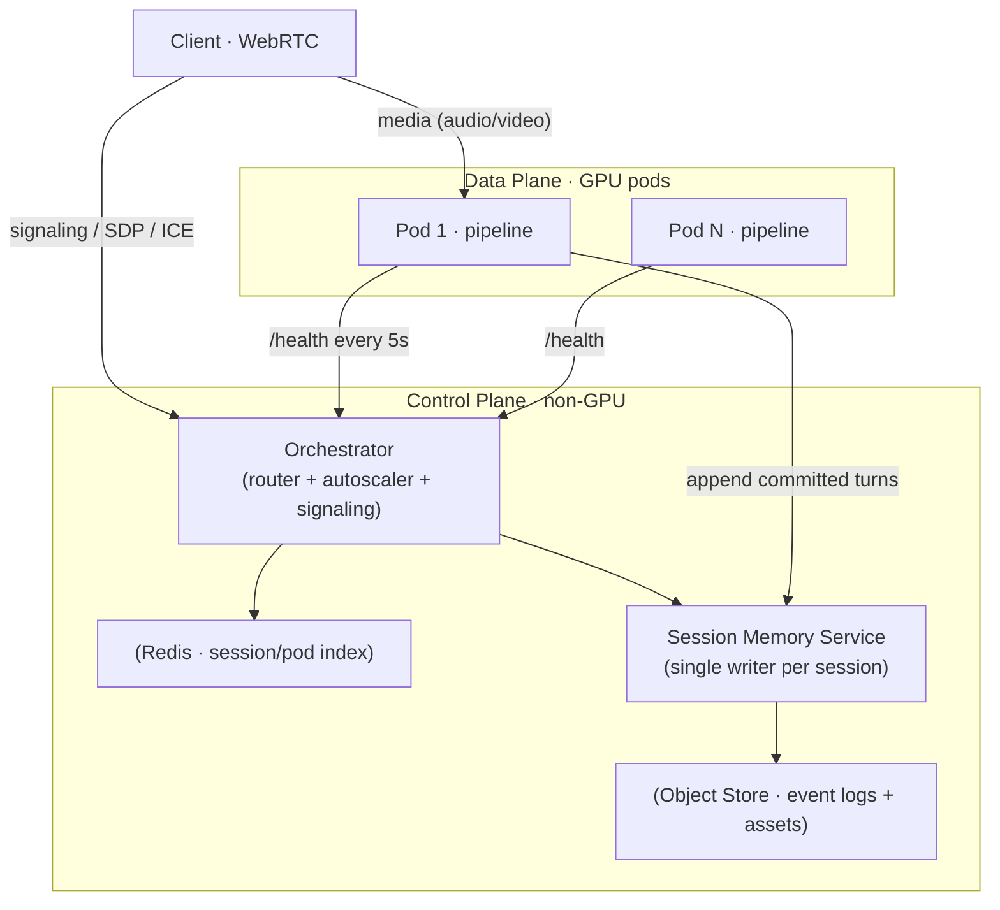
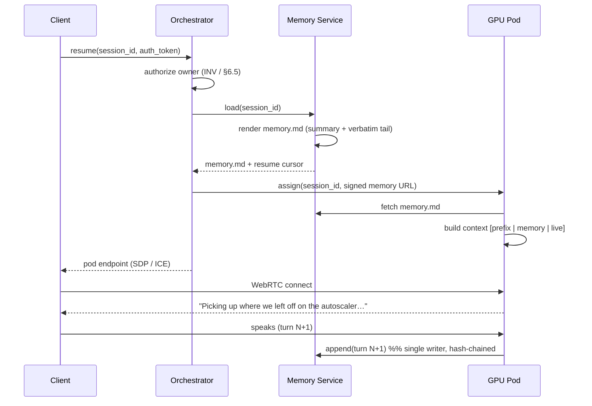

# Virtual Interaction Hosting Suite (VIHS) — Architecture Blueprint v2

*Real-time, low-latency, autonomous audio/video avatar interaction over WebRTC, on auto-scaling GPU compute, with durable resumable session memory.*

---

## 0. What changed from v1 (and why)

The v1 blueprint is a solid skeleton. This revision hardens it around the four things that actually make or break a real-time avatar system, and adds the resumable-memory subsystem you asked for:

1. **A real latency budget.** The naive pipeline (wait for full LLM text → full TTS → full video) blows past 1.5 s. The system only works if every stage is *streamed and pipelined at clause granularity*. This is treated as a first-class constraint, not a footnote.
2. **Turn-taking and barge-in.** v1 has no Voice Activity Detection, no endpointing, and no interruption handling. In real conversation these are not optional — they're most of what "feels natural" means.
3. **Honest capacity math.** "5 users per 4090" is a hypothesis, not a law. The renderer is almost always the binding constraint; the number gets *derived and load-tested*, not assumed.
4. **Durable, pod-independent session memory + resume.** A `session_id` that survives disconnects, recalls a full markdown transcript, and re-injects it as context — designed to be prefix-cache-friendly so long sessions don't detonate token cost or latency.

---

## 1. System Overview

VIHS ingests a user's live audio (and optionally video), produces an autonomous spoken response, renders synchronized facial/lip motion onto a base visual asset ("the puppet"), and streams the result back over WebRTC — while an orchestration layer scales GPU pods up and down on demand.

The design rests on **three separations of concern** that everything else hangs off:

| Separation | Ephemeral | Durable |
|---|---|---|
| **Identity** | connection, pod assignment | `session_id` (the conversation) |
| **Compute** | GPU pods (disposable) | model weights + assets (network volume) |
| **State** | in-pod runtime buffers | event log + rendered memory (object store) |

If you get these three separations right, resumption, autoscaling, and crash recovery all fall out almost for free. Pods can die, users can reconnect to a different pod, and the *conversation* is untouched.

### Core invariants (the contract the system must never violate)

- **INV-1 — Log what was rendered, not what was generated.** If a turn is interrupted (barge-in) mid-speech, the transcript records the audio the user actually *heard*, not the full text the LLM produced. Memory must match reality.
- **INV-2 — Single writer per session.** All appends to a session's event log funnel through one logical writer. No interleaving, no torn chains.
- **INV-3 — Memory is pod-independent.** No conversational state lives only inside a pod. The last *committed* event is always the resume point.
- **INV-4 — Prefix stability.** The `[system + persona + memory]` context preamble is byte-stable within a session between compaction checkpoints, so the LLM's prefix cache stays hot.
- **INV-5 — Derived artifacts are a cache, never truth.** `transcript.md` and `memory.md` are pure functions of the event log and can always be regenerated.

---

## 2. Identity & State Model

Four IDs, each with a clear lifetime. Keeping them distinct is the whole trick.

| ID | Scope | Lifetime | Purpose |
|---|---|---|---|
| `session_id` | one conversation | **durable** | The resume token. Crypto-random UUIDv4. Survives disconnects. |
| `connection_id` | one WebRTC connection | ephemeral | One transport attempt. |
| `pod_id` | one GPU pod | ephemeral | Which compute node is serving *right now*. Reassignable. |
| `turn_id` | one exchange | monotonic per session | Ordering + resume cursor. |

A **session** is a sequence of **connections**; each connection runs on one **pod**; the session's **memory** is independent of both.

> **Security note up front:** `session_id` is unguessable, but it is *not* an auth token by itself. Resuming a session requires the owner's authenticated credential. A leaked or brute-forced ID must never be sufficient to replay someone's transcript. (See §6.5.)

---

## 3. Core Components



### A. The Orchestrator (Control Plane)

Runs on a cheap non-GPU instance. Owns sessions, routing, GPU lifecycle, and WebRTC signaling.

- **State Manager (Redis):** live index of sessions, pod health, per-pod concurrency, warm-pool state.
- **Router / Load Balancer:** assigns incoming connections to the least-loaded healthy pod under the concurrency cap.
- **Autoscaler Engine:** watches the connection queue and per-pod fill; spins pods **preemptively** (see §8), drains and terminates idle pods after cooldown, holds the warm-pool floor.
- **WebRTC Signaling:** SDP exchange + ICE candidate relay between browser and the assigned pod. TURN relay on hand for NAT-hostile networks.
- **Auth / Session Gateway:** authenticates the user, authorizes `session_id` ownership, mints short-lived pod-access tokens.

### B. Session Memory Service (the new subsystem)

The durable brain of continuity. **Owns the append-only event log for every session** and is the *only* writer (INV-2). Responsibilities:

- Accept `append(session_id, event)` from pods; enforce ordering + the hash chain.
- Serve `load(session_id)` → the compacted `memory.md` blob + resume cursor.
- Run **compaction** (summarize old turns, keep recent turns verbatim) so context stays bounded.
- Render `transcript.md` (full, human-readable) and `memory.md` (context-injection) on demand.

Backed by an object store for logs (`s3://sessions/{session_id}/events.jsonl`) with a Redis index for hot lookups. Detailed in §6.

### C. The Compute Layer (GPU Pods)

Rented GPU nodes (e.g. RunPod / Modal / Lambda RTX 4090-class). Each pod is an independent, **stateless** processing node — everything durable lives in the control plane.

- **Persistent Network Volume (read-mostly):** model weights (STT, LLM, TTS, avatar) + base visual assets, mounted on boot. Eliminates multi-GB downloads on cold start.
- **Custom Docker image:** inference engines (vLLM/SGLang, TensorRT, TTS runtime, lip-sync runtime), media stack (FFmpeg/GStreamer), and the pod agent (pipeline + signaling client + memory-append client).
- **Cold-start mitigation:** models stay resident once loaded; use container snapshot / checkpoint-restore (flashboot-style warm containers, CRIU) where the cloud supports it, plus the warm pool. Target cold start **< 20–30 s**, masked from the user by the frontend eyecandy loop.

### D. The Real-Time Inference Pipeline (inside the pod)

The v1 pipeline was correct but *sequential*. The working version is **streaming and pipelined**, plus two additions that v1 omitted entirely: **turn detection** and **barge-in**.

```
        ┌──────────── barge-in ABORT bus ────────────┐
        │  (VAD fires during playback → flush all)    │
        ▼                                             │
[VAD + endpointing] → [streaming STT] → [LLM] → [TTS] → [lip-sync] → [mux] → WebRTC out
        ▲ user audio in          (clause-by-clause streaming, each stage starts on first chunk)
```

1. **Ingestion + Turn Detection (Ears).** Audio arrives over WebRTC. **VAD** (e.g. Silero) gates speech; a lightweight **endpointer** decides when the user has actually *finished* a turn (semantic endpointing reduces premature cut-offs at the cost of ~100–300 ms). Streaming STT transcribes chunks as they arrive so the transcript is ready the instant endpointing fires.
2. **Cognition (Brain).** Transcript → LLM. Generation **streams token-by-token**. The context is ordered `[stable prefix | memory preamble | live turns]` (INV-4) so the prefix cache serves the persona + memory near-instantly.
3. **Vocalization (Voice).** The moment the LLM emits a completable clause/sentence, it's handed to streaming TTS — **do not wait for the full response.** TTS emits audio chunks continuously.
4. **Visual Generation (Face).** First TTS audio chunk → lip-sync renderer, which drives jaw/lip/blink motion on the base asset and starts emitting frames immediately. A **micro-motion driver** injects idle head nods / shifts / blinks so the puppet never freezes, including while *listening*.
5. **Delivery (Stream).** Frames + audio muxed (FFmpeg/GStreamer) and pushed onto the outbound WebRTC track.
6. **Barge-in (interrupt).** If VAD detects user speech during playback, the pod raises **ABORT** on the internal bus: cancel in-flight LLM generation, flush the TTS queue, stop the renderer, clear the outbound media buffer, and transition the avatar to a neutral listening pose — all within ~100 ms of perceived response. Per **INV-1**, only the audio actually played before the abort is written to the transcript, tagged `interrupted: true`.

### E. Client Frontend

- **WebRTC client:** mic (and camera) capture; renders the incoming A/V track.
- **Buffer / loading state:** during a cold start, plays a pre-loaded high-quality idle loop to mask the 15–30 s spin-up.
- **Session manager:** auth, credit/time tracking, graceful teardown — **and the resume affordance**: stores the user's `session_id`(s) and offers "Resume last session."

---

## 4. The Latency Budget

The number that matters for *perceived* responsiveness is **time from "user stops speaking" to "avatar starts speaking"** — i.e. time-to-first-audio/first-frame, **not** full-response completion. Budget for first-chunk, because pipelining means first-frame latency ≈ the sum of each stage's *first-chunk* latency, not its full-response latency.

| Stage | Measures | Target (first-chunk) | Lever |
|---|---|---|---|
| Endpointing / VAD | detect turn end | 100–300 ms | semantic vs. silence-threshold trade |
| STT final flush | last chunk → text | 50–150 ms | streaming ASR, partials pre-computed |
| LLM time-to-first-token | prompt → first token | 150–400 ms | **prefix cache (persona+memory)**, model size, TTFT-tuned serving |
| First completable clause | enough text for TTS | +100–250 ms | clause-boundary chunking |
| TTS time-to-first-audio | text → first audio | 100–300 ms | low-latency streaming TTS (Cartesia/XTTS/Piper) |
| Lip-sync first frame | audio → first frame | 100–400 ms | **usually the bottleneck**; lighter model or lower warm-up |
| Network + jitter buffer | pod → client | 50–150 ms | TURN only when needed, tuned buffer |

Summed on the critical path, a well-pipelined system lands **first response in ~0.7–1.3 s**, comfortably inside the 1.5 s target. A *sequential, full-response* implementation of the same components easily hits 4–8 s and feels broken. **The pipelining is the product.**

**Prefix-cache tie-in:** because the `[system + persona + memory]` preamble is byte-stable within a session (INV-4), vLLM/SGLang serves it from cache, so LLM TTFT is dominated by the *new* turn's tokens, not the (potentially large) memory blob. This is what makes long resumed sessions stay fast and cheap — the memory preamble is paid for essentially once per compaction epoch, not per turn.

---

## 5. Session Lifecycle & Data Flow

### 5.1 Fresh session

1. **Start.** Client authenticates, requests a new session. Orchestrator mints `session_id`, records it in Redis (owner, created_at, turn 0).
2. **Route.** Orchestrator finds a healthy pod with a free slot (max N per pod). If none, triggers a pod deploy from the image + network volume, queues the user, frontend shows the eyecandy loop.
3. **Establish.** WebRTC connects browser ↔ pod (direct, or via TURN under NAT).
4. **Loop.** VAD/endpoint → STT → LLM → TTS → lip-sync → mux → client, with barge-in active. Each *committed* turn is appended to the event log via the Memory Service.
5. **Terminate.** User disconnects / time expires → stream closes → pod frees the slot → Orchestrator decrements concurrency in Redis. If a pod hits 0 sessions, a cooldown countdown starts; if still empty at expiry (and above warm-pool floor), it's terminated.

### 5.2 Resume (the new path)



The pod never needs to know the session's *history mechanics* — it receives a ready-made `memory.md`, prepends it to the stable prefix, and continues. A resumed session is indistinguishable from a live one to the pipeline.

---

## 6. Memory & Resumption Subsystem (deep dive)

### 6.1 Storage tiers

| Tier | Store | Contents | Truth? |
|---|---|---|---|
| **Event log** | Object store (`events.jsonl` or length-prefixed CBOR) | append-only typed events, hash-chained | ✅ source of truth |
| **Session index** | Redis hash `session:{id}` | `last_turn_id`, `event_count`, `owner`, `summary_ptr`, `live_pod?`, `content_hash`, timestamps | hot cache |
| **Rendered artifacts** | Object store | `transcript.md` (full), `memory.md` (compacted, for injection) | ❌ derived cache (INV-5) |

JSONL is the pragmatic default (greppable, appendable, tooling-friendly). If you want the same canonical-encoding rigor you use elsewhere, length-prefixed **CBOR** gives compact, deterministic records — the schema below maps 1:1.

### 6.2 Event schema

```json
{
  "v": 1,
  "session_id": "7f3a1c9e-…",
  "turn_id": 42,
  "ts": "2026-07-07T18:22:31.482Z",
  "role": "user | assistant | system | tool",
  "kind": "utterance | tool_call | tool_result | note | summary",
  "text": "…what was said / heard…",
  "audio_ref": "s3://sessions/7f3a…/turn-42.opus",   // optional
  "meta": {
    "asr_conf": 0.94,
    "interrupted": false,      // INV-1: true ⇒ text = audio actually played
    "latency_ms": 812,
    "voice": "aria-v2",
    "tokens": 128
  },
  "prev_hash": "blake3:9a2f…",  // hash of previous event
  "hash":      "blake3:4c71…"   // hash over this record's canonical bytes
}
```

**Why the hash chain?** Three payoffs for one cheap field:
- **Tamper-evidence** — any edit to history breaks the chain.
- **Exact resume cursor** — "resume from event whose hash = X" is unambiguous even across crashes.
- **Idempotent append** — a retried write (pod fl=aky, network blip) is a no-op if the hash already exists, so a mid-turn pod death can't double-log.

### 6.3 Deterministic markdown render

`render(events) → markdown` is a pure function (same events ⇒ same bytes). Two renders exist:

- **`transcript.md`** — the complete, human-readable log (for the user to review/export).
- **`memory.md`** — the *bounded* context-injection blob: rolling summary of old turns + verbatim recent tail.

Example `memory.md`:

```markdown
# Session 7f3a — Continuity Memory
Persona: "Aria" · Started 2026-07-05 · Turns: 42 · Compacted through turn 30

## Summary (turns 1–30)
> User is architecting a self-hosted avatar suite. Settled on preemptive
> autoscaling at 4/5 fill, warm-pool floor of 1, and RunPod 4090 pods.
> Open thread: whether to disaggregate the LLM from the renderer.

## Recent turns (31–42, verbatim)
**User** (14:02): Where did we land on the pod autoscaler?
**Aria** (14:02): You chose preemptive scaling at 4 of 5 concurrent…
**User** (14:03): Right. Now I want to add resumable memory.
…
```

### 6.4 Compaction (keeps long sessions cheap *and* fast)

Unbounded transcripts would grow the context every turn — killing both latency and cost, and (worse) destabilizing the prefix (violating INV-4). Compaction bounds it:

- Keep the **last N turns verbatim** (e.g. N = 20).
- At a **compaction checkpoint**, summarize everything older into/onto a rolling `summary` event via a cheap LLM pass, then **freeze it**.
- `memory.md` = frozen summary + verbatim tail. Bounded tokens ⇒ bounded latency ⇒ bounded cost.
- Compaction runs **async at turn boundaries**, or when a token-budget threshold is crossed — never mid-turn. Freezing the summary between checkpoints is what preserves prefix stability, so the cache only cold-misses once per epoch instead of every turn.

### 6.5 Security, privacy, retention

- **Ownership-gated resume.** `session_id` unguessable **and** resumption requires the owner's authenticated credential. ID knowledge alone is never sufficient.
- **Encryption at rest** for event logs and rendered artifacts — transcripts can be sensitive.
- **Scoped pod access.** Pods fetch `memory.md` via short-lived signed URLs, not standing credentials.
- **Retention + deletion.** TTL policy plus a hard user-initiated delete that removes the event log, both rendered artifacts, and the Redis index — a true right-to-be-forgotten, not a soft hide.

### 6.6 Crash recovery (why INV-1/2/3 pay off)

Pod dies mid-turn → the last *committed* event is the resume point (INV-3). The in-flight, uncommitted turn is simply lost; the session is intact. The user reconnects, the Memory Service replays from the last hash-chained event (INV-2 guarantees no torn state), and the pipeline resumes as if nothing happened. Because we log rendered-not-generated (INV-1), the recovered transcript never claims the avatar "said" something the user never heard.

---

## 7. Observability

You cannot tune a real-time pipeline you can't see. Instrument **per-stage first-chunk latency histograms** (VAD, STT, LLM TTFT, TTS TTFA, render TTFF, network) tagged by `pod_id` and model version — so when the budget blows, you know *which* stage did it. Add: barge-in rate and abort-flush time, prefix-cache hit rate (validates INV-4), compaction frequency + memory-blob token size, per-pod concurrency vs. GPU utilization, and cold-start duration distribution.

---

## 8. Scaling & Capacity Rules

- **Concurrency cap — derive, don't assume.** The renderer is usually the binding constraint:
  ```
  sessions_per_gpu ≈ min(
      VRAM_available        / VRAM_per_session,
      gpu_ms_per_second     / (render_ms_per_frame × target_fps)
  )
  ```
  "5 per 4090" is plausible for a *lightweight* lip-sync model; a heavier diffusion-based talking-head may be **1–2 per card**. Treat the cap as a **load-tested figure**, re-measured whenever a model changes. Enforce it hard — exceeding it spikes VRAM and collapses real-time latency for *everyone* on the pod.
- **Warm-pool floor.** Keep ≥ 1 pod hot 24/7 so the first user of the day connects instantly. This is your primary fixed cost.
- **Preemptive scaling.** Deploy the next pod when the current one hits **4/5** fill — never wait for the 5th user to queue behind a cold start.
- **Network-volume dependency.** Pods mount the persistent volume on boot; local disk is runtime cache only.
- **Health checks.** Ping each pod's `/health` every 5 s. On crash: terminate, spin a replacement, and **reconnect queued/affected users to their session** via the resume path (§5.2) — the durable log means they lose at most the in-flight turn.

### Monolithic pod vs. disaggregated services (the tradeoff v1 didn't name)

| | **Monolithic pod** (v1 default) | **Disaggregated** |
|---|---|---|
| STT+LLM+TTS+render | all co-located on one GPU | rendered per-session on GPU; LLM/TTS pooled or via API |
| **Latency** | lowest — no inter-service hops | +network hops per stage |
| **Scaling** | scale the whole unit | scale each stage independently to its own bottleneck |
| **Cost efficiency** | simple, can strand capacity | higher utilization at scale |
| **Best for** | launch, low–moderate scale | high scale, heterogeneous load |

Start monolithic (simpler, lowest latency). If the LLM or TTS becomes the utilization bottleneck well before the renderer does, peel *that* stage out into a pooled service. The `session_id`/memory model is unchanged either way.

---

## 9. Technology Menu (engine-agnostic — every row is swappable)

Leaning toward self-hostable / local-first options where they exist, given a privacy-first posture; commercial low-latency options noted where they meaningfully beat OSS on TTFT.

| Layer | Self-hostable options | Managed / low-latency |
|---|---|---|
| Media transport | LiveKit, mediasoup, Pion / webrtc-rs, aiortc, Janus | LiveKit Cloud |
| VAD / endpointing | Silero VAD, WebRTC VAD, LiveKit turn-detector | — |
| Streaming STT | faster-whisper, NVIDIA Parakeet / Riva | Deepgram, AssemblyAI |
| LLM serving | **vLLM, SGLang, TensorRT-LLM** (prefix caching!) | — |
| Streaming TTS | Piper (fast/local), XTTS / Coqui, StyleTTS2 | Cartesia, ElevenLabs |
| Lip-sync / avatar | Wav2Lip-family, SadTalker, real-time talking-head models* | HeyGen, D-ID, Tavus |
| Mux | FFmpeg, GStreamer | — |
| Orchestrator | your service (Rust/Go/Python) + Redis/KeyDB | — |
| Object store | MinIO | S3, Cloudflare R2 |
| Hot index | Redis / KeyDB | managed Redis |
| GPU cloud | RunPod, Lambda, CoreWeave, Fly GPU | Modal |

\* The real-time talking-head space moves fast — validate the current best on *your* latency + VRAM budget rather than trusting any fixed recommendation.

---

## 10. Suggested build sequence

1. **Vertical slice, one pod, no scaling.** Full pipeline with streaming + barge-in on a single pod. Prove the latency budget end-to-end. This de-risks everything.
2. **Memory Service + resume.** Event log, hash chain, markdown render, resume path. Prove a session survives disconnect/reconnect and recalls context.
3. **Compaction + prefix-cache validation.** Add rolling summary; confirm cache hit rate and stable per-turn latency on a long session.
4. **Orchestrator + autoscaling.** Warm pool, preemptive scale, health-check recovery, capacity load-test to *derive* the real per-GPU cap.
5. **Hardening.** Auth-gated resume, encryption, retention/deletion, TURN fallback, observability dashboards, chaos-test (kill pods mid-turn and confirm clean resume).

---

*This blueprint stays engine-agnostic: swap any row in §9 without touching the identity model (§2), the invariants (§1), or the memory subsystem (§6) — which is exactly where the durability and resumability live.*
